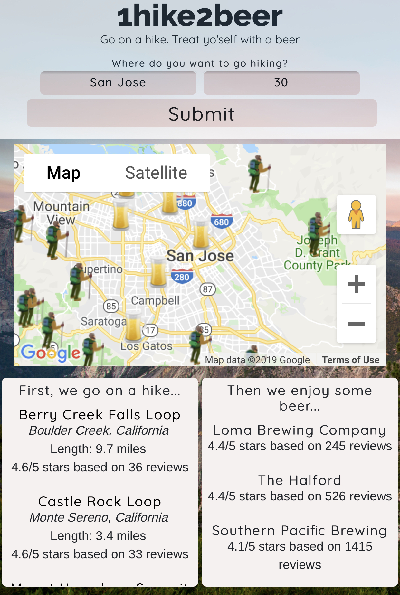

# 1hike2beer
https://slertka.github.io/1hike2beer/

## Summary
This app enables users to search for hikes in a given area to return results of hikes and breweries in the given area. The app requires two inputs to be submit: search location and search radius.

The hike and brewery results are displayed both visually on the map and in a list. The map displays a hiking boots icon for hikes in the area and a beer icon for breweries in the area.

### Desktop View
#### Home Page

#### Results Page

### Mobile View
#### Home Page

#### Results Page

### Technology Used
(HTML / CSS / JavaScript / jQuery)
